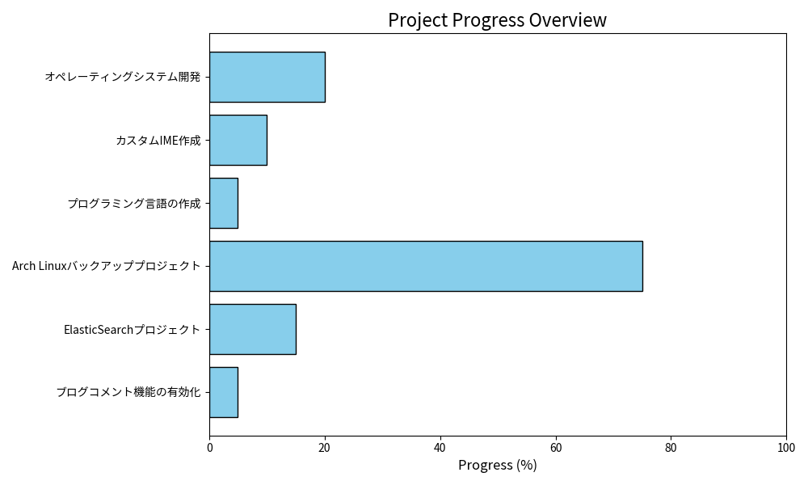

# 🚀 ProjectJourney

**ProjectJourney** へようこそ！  
このリポジトリは、プロジェクトの進捗を記録し、学びと成長を共有するための場所です。技術スキルの探求と達成を目指す、この「旅」にあなたも参加してください。

---

## 📊 プロジェクト進捗グラフ (Project Progress Graph)

以下の棒グラフには、各プロジェクトの進捗状況が表示されます：

> **注**: このグラフは毎週月曜日に自動更新されます。

---

## 🌟 プロジェクト概要 (Project Overview)

| プロジェクト名 (Project Name)             | 目標 (Goal)                                | 進捗状況 (Progress)  | 次のステップ (Next Step)        |
|-------------------------------------------|--------------------------------------------|----------------------|---------------------------------|
| **オペレーティングシステム開発** (OS Development) | 完全な独自OSの開発 (Develop and launch custom OS) | 🔸 初期段階 (Initial Stage) | 🔹 必要な機能をリサーチ中 (Researching essential features) |
| **カスタムIME作成** (Custom IME Creation) | 日本語IMEの構築 (Create a custom IME for Japanese input) | 🔸 初期段階 (Initial Stage) | 🔹 基本入力機能の実装 (Consider implementing basic input features) |
| **プログラミング言語の作成** (Programming Language Creation) | 新プログラミング言語の開発 (Develop a new programming language) | 🔸 構想段階 (Conceptual Stage) | 🔹 言語仕様の決定 (Define syntax and specifications) |
| **Arch Linuxバックアッププロジェクト** (Arch Linux Backup Project) | mini PCバックアップ環境の構築 (Establish a backup environment on mini PC) | 🔹 中間段階 (Mid-stage) | 🔸 rsyncスクリプトの最適化と自動化 (Optimize and automate rsync script) |
| **ElasticSearchプロジェクト** (ElasticSearch Project) | Consense内の全プロジェクトで全文検索を可能にする (Enable full-text search across all projects in Consense) | 🔸 初期段階 (Initial Stage) | 🔹 インデックス作成のテスト (Test index creation) |
| **ブログコメント機能の有効化** (Enable Blog Comment Feature) | ブログにコメント機能を追加 (Add a comment feature to the blog) | 🔸 検討段階 (Consideration Stage) | 🔹 使用するプラグインやサービスを選定 (Select plugins or services to use) |

---

## 🔍 プロジェクト詳細 (Project Details)

### 1. **オペレーティングシステム開発 (OS Development)**
- **目標 (Goal):** 独自のOSを一から開発し、安定して実行可能にする
- **進捗 (Progress):** 必要な機能をリサーチ中で、システム構成を検討中
- **チャレンジ (Challenges):** カーネルレベルの知識を深める必要がある
- **次のステップ (Next Step):** システムアーキテクチャの基本設計を完成させる

### 2. **カスタムIME作成 (Custom IME Creation)**
- **目標 (Goal):** 日本語入力に対応したIMEをゼロから作成する
- **進捗 (Progress):** 基本的な入力処理の仕組みを検討中
- **チャレンジ (Challenges):** 効率的な文字変換アルゴリズムを実装する方法の模索
- **次のステップ (Next Step):** 入力処理のプロトタイプを作成

### 3. **プログラミング言語の作成 (Programming Language Creation)**
- **目標 (Goal):** 新しいプログラミング言語をデザインし、サポート機能を追加
- **進捗 (Progress):** 言語仕様の基本的なアイディアを練っている段階
- **チャレンジ (Challenges):** 独自のシンタックス設計と構文解析の実装
- **次のステップ (Next Step):** 言語の構文ルールをドキュメント化

### 4. **Arch Linuxバックアッププロジェクト (Arch Linux Backup Project)**
- **目標 (Goal):** mini PC上でのバックアップ環境を安定稼働させる
- **進捗 (Progress):** rsyncスクリプトによる自動化の最適化に取り組んでいる
- **チャレンジ (Challenges):** 異なるファイルシステム間の互換性問題
- **次のステップ (Next Step):** バックアップスクリプトの定期テストを実施

### 5. **ElasticSearchプロジェクト (ElasticSearch Project)**
- **目標 (Goal):** Consense内の全プロジェクトで全文検索を可能にする
- **進捗 (Progress):** 初期段階でインデックス作成をテスト中
- **チャレンジ (Challenges):** 大量データのインデックス化とクエリ最適化
- **次のステップ (Next Step):** パフォーマンステストを実施し、インデックス設定を微調整

### 6. **ブログコメント機能の有効化 (Enable Blog Comment Feature)**
- **目標 (Goal):** コメント機能を追加して読者の交流を促進する
- **進捗 (Progress):** 使用するプラグインやサービスを選定中
- **チャレンジ (Challenges):** プラグイン選定、スパム対策の実装
- **次のステップ (Next Step):** コメント機能をテスト環境で実装し、動作確認

---

## 🎯 今後の目標 (Future Goals)

今後も進捗があればこのリポジトリにアップデートし、新しい学びや課題を共有していく予定です。ぜひフォローして、成長の旅を応援してください！

## 📢 お問い合わせ (Contact)
プロジェクトに関する質問や提案がありましたら、気軽にお問い合わせください。

- **Twitter**: [@chapi2082](https://twitter.com/chapi2082)

